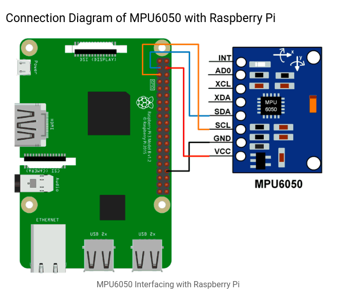

# MPU6050 Driver for ROS2
This repository contains a ROS2 package that interfaces with an MPU6050 sensor over I2C. The sensor is calibrated on node startup (sensor needs to be on a plane with z-axis up and should not be moved during calibration). Calibration can be turned off in the parameters file. The output is an IMU ROS message but the quaternion part is currently set to zero.

## Dependencies
-  libi2c-dev

## Setup
The number of iterations for calibration can be set up in `include/mpu6050driver/mpu6050sensor.h`.
Following other parameters and default values are listed here and can be changed in `params/mpu6050.yaml`.
```    calibrate: True
    gyro_range: 0
    accel_range: 0
    dlpf_bandwidth: 2
    gyro_x_offset: 0.0 # [deg/s]
    gyro_y_offset: 0.0 # [deg/s]
    gyro_z_offset: 0.0 # [deg/s]
    accel_x_offset: 0.0 # [m/s²]
    accel_y_offset: 0.0 # [m/s²]
    accel_z_offset: 0.0 # [m/s²]
    frequency: 100 # [Hz]
```

Build the package in your workspace:

    colcon build --packages-select mpu6050driver

Source setup.bash in your workspace:

    . install/setup.bash
    
Launch it:

    sudo usermod <user_name> -aG i2c
    ros2 launch mpu6050driver mpu6050driver_launch.py



